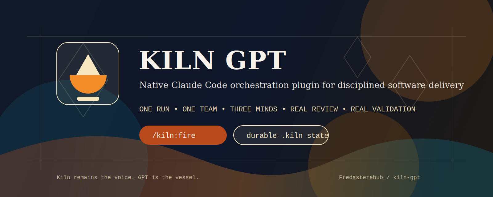
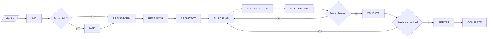
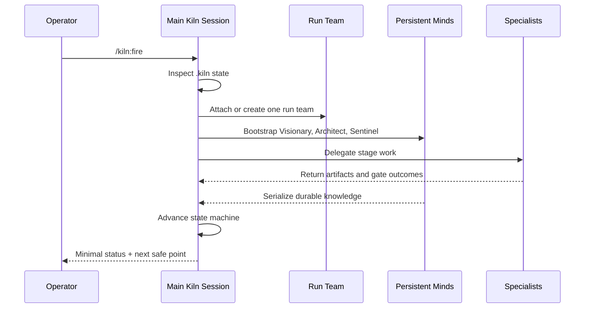

<p align="center">
  
</p>

<p align="center">
  <strong>Kiln remains the voice. GPT is the vessel.</strong>
</p>

<p align="center">
  Native Claude Code plugin for disciplined, multi-stage software delivery.
</p>

<p align="center">
  <a href="https://github.com/Fredasterehub/kiln-gpt"></a>
  <a href="LICENSE"></a>
  
  
</p>

## What Kiln GPT Is

Kiln GPT is a native Claude Code plugin that runs a full delivery workflow with
deliberate stage gates, persistent internal minds, durable run state, and a
real fallback path when Codex is unavailable.

It is not a generic swarm.
It is a constrained build system with memory, stage discipline, and review.

## The Shape

<table>
  <tr>
    <td width="33%">
      <strong>One Run</strong><br>
      One durable state machine per project run.
    </td>
    <td width="33%">
      <strong>One Team</strong><br>
      One Claude team per run, preserved across stages.
    </td>
    <td width="33%">
      <strong>Three Minds</strong><br>
      Visionary, Architect, and Sentinel hold continuity.
    </td>
  </tr>
</table>



## Why This Rebuild Exists

The older Kiln proved the product shape, but too much critical behavior was
implicit inside a single command. This rebuild makes the hard parts explicit:

- runtime control is separate from domain work
- files are durable truth, not decorative memory
- persistent minds own durable artifacts
- planning, execution, review, validation, and reporting each have contracts
- Codex is a first-class accelerator, not a hidden structural dependency
- Claude-only fallback is real, not marketing

## Command Surface

| Command | Purpose |
|---|---|
| `/kiln:fire` | Start, continue, or supervise a run |
| `/kiln:peek` | Read current run state and next safe point |
| `/kiln:resume` | Recover a paused, failed, or aborted run |
| `/kiln:reset` | Archive or clear broken state safely |
| `/kiln:doctor` | Diagnose plugin, workspace, and bridge readiness |

## End-to-End Workflow

### 1. Control Plane

The main session is the supervisor.
It inspects `.kiln/`, routes the run, advances the state machine, and keeps the
ambient context lean.

Core references:

- [`references/fire-control-loop.md`](references/fire-control-loop.md)
- [`references/run-contract.md`](references/run-contract.md)
- [`references/runtime-schemas.md`](references/runtime-schemas.md)

### 2. Persistent Minds

Three long-lived internal actors preserve continuity across stages:

- `Visionary`: user value, scope, and acceptance shape
- `Architect`: system shape, sequencing, and tradeoffs
- `Sentinel`: quality memory, patterns, and pitfalls

They are internal team members, not operator chat endpoints.

Reference:

- [`references/mind-contracts.md`](references/mind-contracts.md)

### 3. Stage Specialists

Kiln delegates bounded work to stage-specific agents:

- `Da Vinci`: brainstorm facilitation
- `Mnemosyne`: brownfield mapping
- `Confucius`, `Sun Tzu`, `Socrates`, `Plato`, `Athena`: planning stack
- `Scheherazade`, `Workers`, `Sphinx`, `Sherlock`: execution stack
- `Argus` and tester: validation
- reporter: final handoff

### 4. Durable Artifacts

Everything important lives under project-local `.kiln/` state:

```text
.kiln/
  config.json
  current-run.txt
  runs/
    <run_id>/
      STATE.md
      manifest.md
      events.md
      docs/
      tasks/
      reports/
```

This is what makes resume and auditability real.

## Session and Team Model



Rules:

- one team per run
- one supervisor for lifecycle control
- one owner per durable artifact
- resume from files, not guessed chat memory

## Planning, Execution, Validation, Reporting

| Stage | Contract |
|---|---|
| Discovery | [`references/brainstorm-contract.md`](references/brainstorm-contract.md) |
| Brownfield Mapping | [`references/brownfield-mapping-contract.md`](references/brownfield-mapping-contract.md) |
| Planning | [`references/planning-contract.md`](references/planning-contract.md) |
| Execution | [`references/execution-contract.md`](references/execution-contract.md) |
| Review | [`references/review-contract.md`](references/review-contract.md) |
| Validation | [`references/validation-contract.md`](references/validation-contract.md) |
| Reporting | [`references/reporting-contract.md`](references/reporting-contract.md) |
| UX Discipline | [`references/ux-contract.md`](references/ux-contract.md) |

## Fallback Philosophy

Kiln should still run when Codex CLI is missing.
It should become less sharp, not unusable.

- best path: Opus + Sonnet + Codex bridge
- fallback path: Opus + Sonnet only

The bridge contract lives here:

- [`skills/kiln-bridge/SKILL.md`](skills/kiln-bridge/SKILL.md)

## Repository Map

| Path | Purpose |
|---|---|
| [`.claude-plugin/plugin.json`](.claude-plugin/plugin.json) | Claude Code plugin manifest |
| [`skills/`](skills) | User-facing and shared plugin skills |
| [`agents/`](agents) | Plugin-provided subagents and persistent minds |
| [`references/`](references) | Runtime contracts, schemas, data, and templates |
| [`plan/`](plan) | Product plan, architecture, backlog, and operator decisions |

## Quick Start

### Validate the plugin

```bash
claude plugin validate /path/to/kiln-gpt
```

### Run it locally in development

```bash
claude --plugin-dir /path/to/kiln-gpt
```

### Then use

```text
/kiln:fire
/kiln:peek
/kiln:resume
/kiln:reset
/kiln:doctor
```

## Current Status

The contract surface is implemented across:

- control plane
- Stage 1 discovery
- Stage 2 planning
- Stage 3 execution
- Stage 4 validation
- Stage 5 reporting
- UX/output discipline

What remains is the only thing that counts now: live proof.

Track it here:

- [`plan/IMPLEMENTATION-BACKLOG.md`](plan/IMPLEMENTATION-BACKLOG.md)

## Development Principle

Do not reopen settled operator-experience questions unless the files expose a
real contradiction.

Build quality first.
Naming games later.
